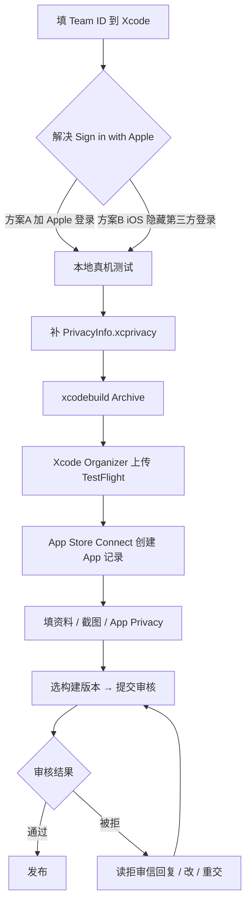

# Nexior / AceData — iOS 上架流程手册

> 这是面向作者本人的实操手册，最后更新 2026-05-23。

---

## 0. App 关键信息（本仓库现状）

| 字段 | 值 |
| --- | --- |
| App 名 (Info.plist) | `AceData` |
| Bundle ID | `com.acedatacloud.nexior` |
| 当前版本 | `3.35.0` (build `33500`) |
| iOS 部署目标 | 16.0 |
| Capacitor | 8.x |
| Xcode 项目 | `ios/App/App.xcworkspace` |
| App Icon 源文件 | `ios/App/App/Assets.xcassets/AppIcon.appiconset/AppIcon-512@2x.png` (1024×1024) |

> 版本号通过 `node scripts/sync-native-version.js` 从 `package.json` 同步到
> Android `build.gradle` 和 iOS `project.pbxproj`。

---

## 1. 准备工作（一次性）

### 1.1 Apple Developer Team ID

1. 浏览器登录 <https://developer.apple.com/account>
2. 右上头像 → Membership → **Team ID** 是一串 10 位字符（例如 `ABC123DEF4`）
3. 把这个 Team ID 配置到 Xcode：
   - 打开 `ios/App/App.xcworkspace`
   - 选中蓝色 `App` 工程 → `Signing & Capabilities` 标签
   - `Team` 下拉选择你的开发者团队（Germey Technology, LLC）
   - 勾选 `Automatically manage signing`
   - 看到 `Provisioning Profile: Xcode Managed Profile` 即配置完成

### 1.2 在 Apple Developer 注册 App ID

> Xcode 选了 Team + Automatic Signing 后，**首次构建时会自动创建** App ID
> `com.acedatacloud.nexior`。一般不需要手动去 developer.apple.com 注册。
> 例外：需要付费 IAP / 推送通知等 entitlements 时。

### 1.3 在 App Store Connect 创建 App 记录

1. <https://appstoreconnect.apple.com> → **My Apps** → `+` → **New App**
2. 填：
   - **Platform**: iOS
   - **Name**: `AceData`（30 字符内，可与 Bundle 名不同）
   - **Primary Language**: 简体中文（或 English，看主市场）
   - **Bundle ID**: 下拉选 `com.acedatacloud.nexior - AceData`
     （首次本地构建过后才会出现在下拉里；如果没有，回到 1.1 做一次构建）
   - **SKU**: `ACEDATA-IOS-001`（自己起，不公开）
   - **User Access**: Full Access

---

## 2. 上架前必须解决的问题

### 2.1 🚨 Sign in with Apple（App Store Guideline 4.8）

**只要 App 提供任意一种第三方 Social Login（Google / GitHub / WeChat / 微信
等），就必须同等显眼地提供 "Sign in with Apple"**，否则审核 95% 会被拒。

当前登录页同时有 GitHub / WeChat / Google → 触发 4.8。

两个解决方案择一：

**方案 A — 加 Sign in with Apple（长期方案）**
- AuthBackend 新增 `apple` social provider，按 [Apple JS Web Sign-In](https://developer.apple.com/documentation/sign_in_with_apple/sign_in_with_apple_js)
  接入；iOS 内还可调原生 `AuthenticationServices.framework`
- 登录页加 Apple 黑色按钮（位置要与 Google 等同级）
- 工作量：1–2 天

**方案 B — iOS 版本隐藏全部第三方登录（快速上架）**
- 在 AuthFrontend 用 `import.meta.env.VITE_SURFACE === 'ios'` 判断
- iOS 包内只保留 Email + 手机号 + Passkey + Register
- 待 A 方案落地后再放开
- 工作量：半天

### 2.2 隐私清单（PrivacyInfo.xcprivacy）

iOS 17+ App Store 强制要求声明使用的"必需理由 API"和数据收集。Capacitor 主
框架已自带 `PrivacyInfo.xcprivacy`，但 App 本身需要补一份。

**最小化模板**（贴到 `ios/App/App/PrivacyInfo.xcprivacy`）：

```xml
<?xml version="1.0" encoding="UTF-8"?>
<!DOCTYPE plist PUBLIC "-//Apple//DTD PLIST 1.0//EN" "http://www.apple.com/DTDs/PropertyList-1.0.dtd">
<plist version="1.0">
<dict>
  <key>NSPrivacyTracking</key>
  <false/>
  <key>NSPrivacyTrackingDomains</key>
  <array/>
  <key>NSPrivacyCollectedDataTypes</key>
  <array>
    <dict>
      <key>NSPrivacyCollectedDataType</key>
      <string>NSPrivacyCollectedDataTypeEmailAddress</string>
      <key>NSPrivacyCollectedDataTypeLinked</key>
      <true/>
      <key>NSPrivacyCollectedDataTypeTracking</key>
      <false/>
      <key>NSPrivacyCollectedDataTypePurposes</key>
      <array>
        <string>NSPrivacyCollectedDataTypePurposeAppFunctionality</string>
        <string>NSPrivacyCollectedDataTypePurposeAccountManagement</string>
      </array>
    </dict>
    <dict>
      <key>NSPrivacyCollectedDataType</key>
      <string>NSPrivacyCollectedDataTypeUserID</string>
      <key>NSPrivacyCollectedDataTypeLinked</key>
      <true/>
      <key>NSPrivacyCollectedDataTypeTracking</key>
      <false/>
      <key>NSPrivacyCollectedDataTypePurposes</key>
      <array>
        <string>NSPrivacyCollectedDataTypePurposeAppFunctionality</string>
      </array>
    </dict>
  </array>
  <key>NSPrivacyAccessedAPITypes</key>
  <array>
    <dict>
      <key>NSPrivacyAccessedAPIType</key>
      <string>NSPrivacyAccessedAPICategoryUserDefaults</string>
      <key>NSPrivacyAccessedAPITypeReasons</key>
      <array>
        <string>CA92.1</string>
      </array>
    </dict>
  </array>
</dict>
</plist>
```

`CA92.1` = 用 UserDefaults 仅访问当前 App 数据。

### 2.3 隐私政策 & 服务条款 URL

App Store Connect 表单**必填**两个公开可访问的 URL：
- Privacy Policy URL
- Terms of Use URL（如使用 IAP 订阅必填，否则可选）

→ 用已有的 <https://acedata.cloud/privacy>（如果没有则需在 Docs 仓库新建一页）
→ 用 <https://acedata.cloud/terms>

---

## 3. App Store 文案草稿（中文区）

### 3.1 App 名称（30 字符上限）

```
AceData — AI 创作集成平台
```

### 3.2 副标题 Subtitle（30 字符上限）

```
AI 聊天 · 绘图 · 视频 · 语音
```

### 3.3 关键词 Keywords（100 字符上限，逗号分隔）

```
AI,ChatGPT,Claude,Gemini,GPT,绘图,文生图,Midjourney,Sora,文生视频,Suno,AI音乐,API,大模型
```

### 3.4 推广文本 Promotional Text（170 字符，可随时更新无需重新审核）

```
一站式接入 GPT、Claude、Gemini、Midjourney、Sora、Veo、Suno 等 50+ AI 模型。无需账号、无需配置，开箱即用。新用户注册即送免费额度。
```

### 3.5 应用描述 Description（4000 字符上限）

```
AceData 是一个聚合主流 AI 模型的创作平台。一个账号、一份额度，使用所有大模型。

【强大的对话】
- GPT-5、GPT-5 Mini、Claude Sonnet 4.5、Gemini 2.5、Grok 4 等顶级语言模型
- 联网搜索、图像理解、长文档分析、代码执行
- 流式输出，对话历史云端同步

【图像创作】
- Midjourney 最新版本，Niji 动漫风格
- Flux Pro / Ultra / Kontext 高质量出图与编辑
- Seedream、Nano Banana、Imagen 等多模型并行
- 文生图、图生图、局部重绘、风格迁移

【视频生成】
- OpenAI Sora、Google Veo 3、Kling、Hailuo、Luma、Wan
- 文生视频、图生视频、视频续作
- 1080P 高清输出

【AI 音乐】
- Suno 全模型支持，文生音乐
- 自定义歌词、风格、人声分离
- MP3、WAV、MP4 多格式输出

【面向开发者】
- 所有功能开放 OpenAI 兼容 API
- 详尽文档：acedata.cloud/docs
- SDK 与 MCP Server 支持

【关于账号】
- 邮箱、手机号、Passkey、Sign in with Apple 一键注册
- 跨设备同步对话与作品
- 数据加密存储，绝不用于训练模型

立即下载，开启 AI 创作之旅。

—————
官网：acedata.cloud
意见反馈：office@acedata.cloud
```

### 3.6 What's New（每次更新填）

```
3.35.0 首发版本
- 整合 50+ 主流 AI 模型，统一对话与创作
- 支持 GPT-5、Claude Sonnet 4.5、Gemini 2.5 等最新模型
- 图像、视频、音乐生成一站式
- 支持 Sign in with Apple、Passkey 安全登录
```

### 3.7 支持网址 & 营销网址

- **Support URL**: <https://acedata.cloud/help> 或 <https://github.com/AceDataCloud/Nexior/issues>
- **Marketing URL**: <https://acedata.cloud>

---

## 4. App Privacy 表单（Connect 内的 "App Privacy"）

按当前 Nexior 业务，需要勾选的数据类别：

| Category | Linked? | Tracking? | Purpose |
| --- | --- | --- | --- |
| Contact Info → Email Address | Yes | No | App Functionality, Account Management |
| Identifiers → User ID | Yes | No | App Functionality |
| Usage Data → Product Interaction | Yes | No | Analytics, App Functionality |
| Diagnostics → Crash Data | Yes | No | App Functionality |
| User Content → 用户生成的图片/文本/音乐 | Yes | No | App Functionality |

**Tracking** 一栏全部 No（我们不做跨 App 跟踪、不卖数据）。

---

## 5. 截图要求（App Store Connect 上传）

只**强制**两种尺寸（6.9" 和 6.5"），iPad 可选：

| 设备 | 分辨率 | 数量 | 模拟器型号 |
| --- | --- | --- | --- |
| 6.9" iPhone | 1320×2868 | 至少 3 张，建议 5 张 | iPhone 17 Pro Max |
| 6.5" iPhone | 1284×2778 | 至少 3 张，建议 5 张 | iPhone 11 Pro Max（已淘汰）或后处理 |

> 一个小技巧：只准备 6.9"，剩下尺寸 Apple 会用同一组自动 fallback。

**截图建议页面**：
1. 登录页（品牌展示）
2. AI 对话主界面（GPT-5 / Claude 对话）
3. AI 绘图（Midjourney/Flux 出图结果）
4. AI 视频（Sora/Veo 生成）
5. AI 音乐（Suno 作品列表）

---

## 6. 完整提交流程（从今天开始）



时间预估（第一次上架）：
- 物料准备：1–2 天
- TestFlight 测试：1 天
- Apple 审核：1–3 天

---

## 7. Archive 上传步骤（真正提交时）

1. 切到真机或 `Any iOS Device (arm64)` target
2. Xcode 菜单 `Product → Scheme → Edit Scheme`，确保 Build Configuration = `Release`
3. `Product → Archive`（耗时 5–10 分钟）
4. Archive 完成后 Organizer 自动弹出
5. 选刚生成的 Archive → `Distribute App` → `App Store Connect` → `Upload`
6. 上传成功后等 10–30 分钟（Apple 处理二进制），TestFlight 里会出现这个 build
7. App Store Connect → 你的 App → `+ Version` → 选这个 build → 填资料 → 提交

---

## 8. 常见拒审原因 checklist

- [ ] 4.8 缺 Sign in with Apple → 见 §2.1
- [ ] 5.1.1 缺 隐私政策 URL → 见 §2.3
- [ ] 2.5.13 缺 PrivacyInfo.xcprivacy → 见 §2.2
- [ ] 4.2 "App 内容不足"——审核员看不到完整功能（要求**填测试账号**）
- [ ] 3.1.1 IAP 绕道——如果 App 内能买额度，必须通过 Apple IAP；
  外部 Web 支付链接会被拒（**建议 iOS 版本完全隐藏充值入口**，
  让用户去网页付款）
- [ ] 1.5 联系方式缺失——Support URL 必须可访问

---

## 9. 维护命令速查

```bash
# 同步版本号到 Android + iOS
node scripts/sync-native-version.js

# 仅构建 iOS web 包
npm run build:ios

# 拷贝 web 到原生 + 装 Pod
npx cap sync ios

# 打开 Xcode
npx cap open ios
# 等价于：open ios/App/App.xcworkspace

# 模拟器构建（不签名）
cd ios/App
xcodebuild -workspace App.xcworkspace -scheme App \
  -configuration Debug -sdk iphonesimulator \
  -destination 'platform=iOS Simulator,name=iPhone 17 Pro' \
  CODE_SIGNING_ALLOWED=NO build

# 启动模拟器装包
xcrun simctl boot 'iPhone 17 Pro'
open -a Simulator
xcrun simctl install booted <path-to-App.app>
xcrun simctl launch booted com.acedatacloud.nexior

# 截图
xcrun simctl io booted screenshot screenshot.png
```
