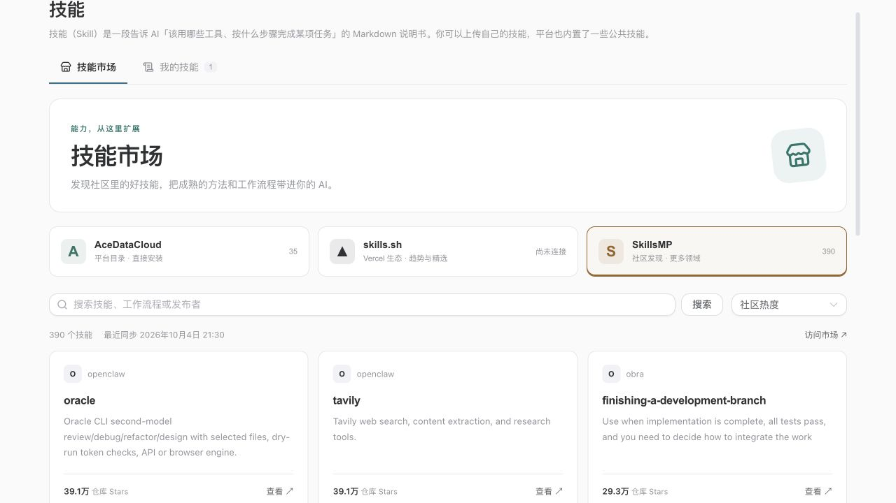

# Skill marketplace

The Skills console now opens a full marketplace with a separate **My skills**
view. The same marketplace component is reused in skill picker dialogs.

- AceDataCloud: the platform's mirrored catalog, publisher filtering, local
  installation counts, content updates and direct installation.
- skills.sh: trending, hot and official discovery, with marketplace install
  counts. An unconnected source is explicitly labelled.
- SkillsMP: a daily discovery collection across marketing, design, development
  and research. Stars refer to the source repository, not skill installations.

Search runs against the locally synchronized collection. Each source shows its
last successful sync; stale or failed refreshes keep their previous results.
Skill details link to the original source. External imports check licensing and
packaging, but still require the user to review runtime/tool requirements.

Requires AuthBackend's `/api/v1/skills/marketplaces/` endpoints and migrations.
Deploy the backend before this frontend. skills.sh additionally requires a
rotating Vercel project identity configured on the backend.

The screenshot below is a local preview using real SkillsMP discovery data and
a local test database. It does not indicate a production deployment.

